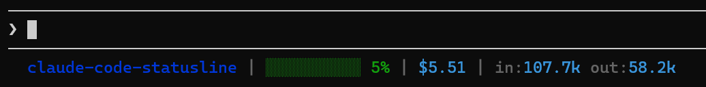

# Claude Code Status Line

Custom status line for Claude Code CLI showing:
- Working directory (bold blue)
- Context usage with color-coded progress bar (green/yellow/red)
- Session cost
- Token counts (input/output)



## Install

```bash
git clone git@github.com:wynandw87/claude-code-statusline.git
cd claude-code-statusline
bash install.sh
```

Restart Claude Code after installing.

## Requirements

- `node` (for JSON parsing)
- Claude Code CLI
